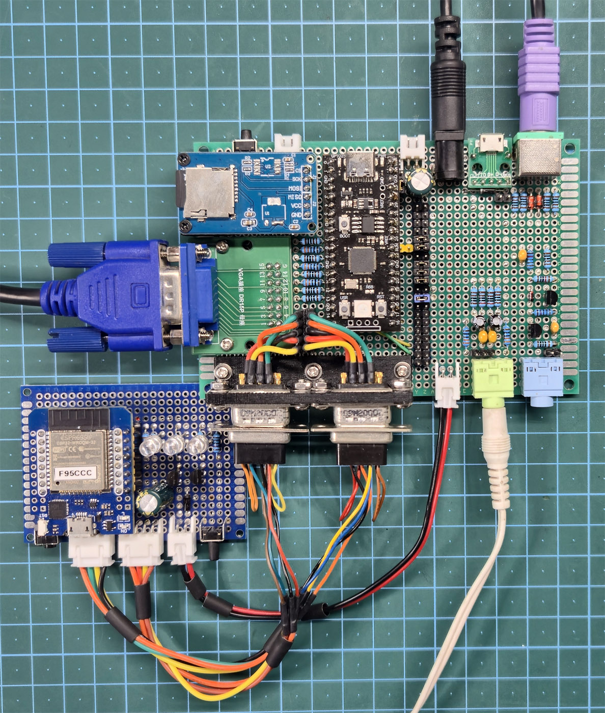
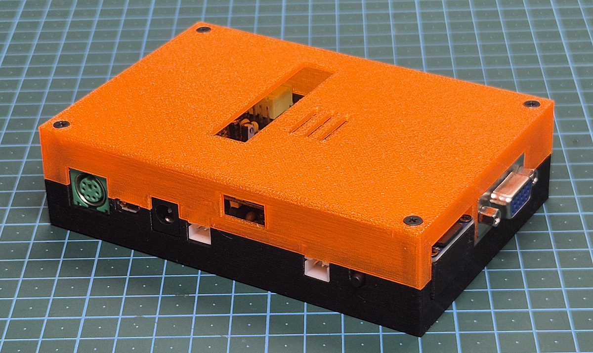
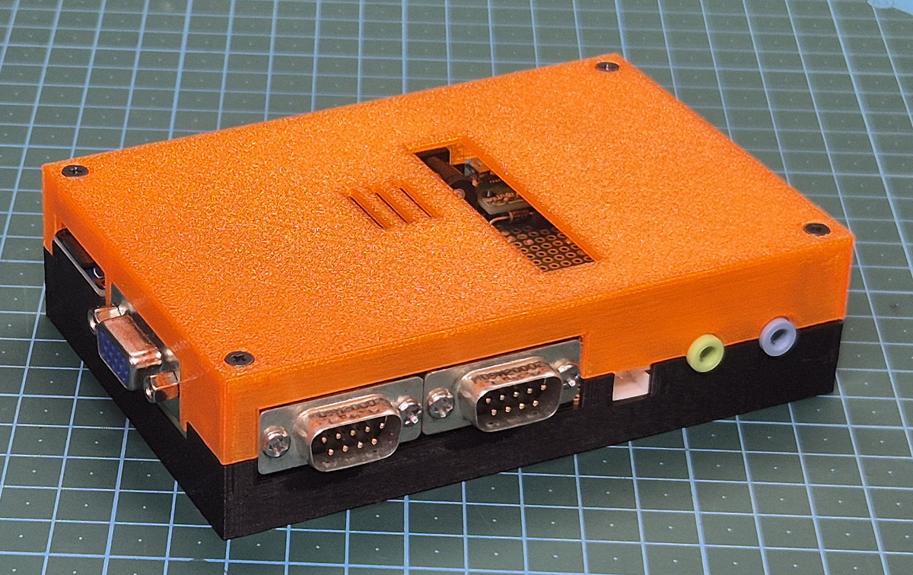

*Read this document in Russian: [README.md](README.md)*

# Murmulator — RP2040 Black Clone, VGA Build on Perfboard

A Murmulator build (an adapter board from a Raspberry Pi Pico / YD-RP2040 clone to peripherals) with VGA output, a PS/2 keyboard, two joystick ports (with Bluetooth gamepad support via BlueRetro), audio output, an audio input for loading programs, a MicroSD slot, and external power. The board is assembled on perfboard; the schematic is laid out in KiCad.

## Board Connectors

| Connector | Purpose |
|---|---|
| J1 | External power (PSU), DC jack → `+5V_RAW` rail |
| J2 | Tap of the `+5V_RAW` rail — for external peripherals (BlueRetro) |
| J3 | VGA (12-pin header, Conn_02x06) |
| J4 | Keyboard (PS/2, Mini-DIN-6) |
| J5 | External connector (EXT, 40 pins); jumpers on pin pairs connect PS/2, sound and the audio input to the GPIOs |
| J6 | Joystick 1 (DE-9) |
| J7 | Joystick 2 (DE-9) |
| J8 | Audio output |
| J9 | Audio input (loading programs from TAP/tape) |
| J10 | `+3V3` tap (JST-XH) |
| J11 | Tap of the `+5V_VOUT` node (the same node as keyboard J4) |
| J12 | Second power input from USB (Micro USB module) instead of the DC jack → via D1 to the `+5V_RAW` rail |
| J13 | Selector (jumper): `+5V_RAW` → Vin (default) or → Vout |
| J14 | Jumper bypassing D1 |
| J15 | MicroSD module (SPI) |
| J16 | Duplicate of J2 on the other side of the board |

## Documentation

- [`doc/murmulator-vga-project-summary_EN.md`](doc/murmulator-vga-project-summary_EN.md) — full build write-up (EN): SD module rework, VGA, PS/2 keyboard, joysticks and BlueRetro integration, audio output and audio input, J5 connector, power, build checklist. Russian version: [`doc/murmulator-vga-project-summary.md`](doc/murmulator-vga-project-summary.md).
- [`doc/rp2040-module-powerchain-analysis_EN.md`](doc/rp2040-module-powerchain-analysis_EN.md) — comparison of the power chains of the YD-RP2040 (Black Clone) and the official Raspberry Pi Pico. Russian version: [`doc/rp2040-module-powerchain-analysis.md`](doc/rp2040-module-powerchain-analysis.md).
- [`doc/Firmware/technocat-murmulator-keyboard-mapping_EN.md`](doc/Firmware/technocat-murmulator-keyboard-mapping_EN.md) — PS/2 keyboard to ZX Spectrum mapping in the Tecnocat v0.96.20 firmware, analysis of the "Cursor joystick" mode. Russian version: [`doc/Firmware/technocat-murmulator-keyboard-mapping.md`](doc/Firmware/technocat-murmulator-keyboard-mapping.md).
- [`doc/murmulator-ps2-modifiers-oscillograms_EN.pdf`](doc/murmulator-ps2-modifiers-oscillograms_EN.pdf) — oscillograms of the PS/2 CLK/DATA signals for the modifier keys ([DOCX](doc/murmulator-ps2-modifiers-oscillograms_EN.docx)). Russian version: [PDF](doc/murmulator-ps2-modifiers-oscillograms.pdf), [DOCX](doc/murmulator-ps2-modifiers-oscillograms.docx).
- [`doc/murmulator_perfboard_front.jpg`](doc/murmulator_perfboard_front.jpg) — photo of the perfboard build (front).
- [`doc/murmulator_perfboard_back.jpg`](doc/murmulator_perfboard_back.jpg) — photo of the perfboard build (back).

## Schematics (KiCad)

- [`schematics/rp2040_black_vga/`](schematics/rp2040_black_vga/) — KiCad project source files.
- [`schematics/rp2040_black_vga/plot/rp2040_black_vga.pdf`](schematics/rp2040_black_vga/plot/rp2040_black_vga.pdf) — schematic diagram in PDF.
- [`schematics/rp2040_black_vga/plot/rp2040_black_vga.net`](schematics/rp2040_black_vga/plot/rp2040_black_vga.net) — netlist.

## Reference Materials

- [`doc/YD-2040-2022-V1.1-Schematics_black_clone.pdf`](doc/YD-2040-2022-V1.1-Schematics_black_clone.pdf) — schematic of the YD-RP2040 module (Black Clone).
- [`doc/YD-2040-2022-V1.1 - Powerchain.jpg`](<doc/YD-2040-2022-V1.1 - Powerchain.jpg>), [`doc/RP2040 Official Pico Module - Powerchain.jpg`](<doc/RP2040 Official Pico Module - Powerchain.jpg>) — power chain fragments of the clone and the official Pico schematics.
- [`doc/original_classic_murmulator_37NJU22_emul_RPPICO_card.pdf`](doc/original_classic_murmulator_37NJU22_emul_RPPICO_card.pdf) — original classic Murmulator schematic.
- [`doc/FT SD Module modification.jpg`](<doc/FT SD Module modification.jpg>) — SD module rework.

## Key Build Features

- **SD module** reworked: the AMS1117 regulator and the 74VHCT125A buffer are desoldered and bridged with jumpers — the module becomes a clean 3.3V breakout with no signal-edge degradation at high SPI speeds.
- **VGA** — a passive resistor R2R ladder on GPIO pins, no separate power supply needed.
- **PS/2 keyboard** — powered from Vout (downstream of the BAT54C diode); the CLK/DATA signal lines are level-shifted 5V → 3.3V via a resistor/zener-clamp network.
- **Joysticks (Dendy-type, DE-9)** — the shift register is powered from 3.3V, which removes the need for a protective resistor on DATA.
- **BlueRetro** — a DIY ESP32-based adapter emulates both joystick ports over Bluetooth HID (PS3/4/5, Xbox, Wii/Switch, and others); the CLOCK/LATCH/DATA protocol is identical to a physical Dendy joystick. Requires power on J1 or J12. 3.3V-logic build of the adapter: https://github.com/alex-snigir/BlueRetro-3.3V-logic
- **Audio output** — stereo (L/R) channels plus a mixed-in beeper signal (BEEP_OUT).
- **Audio input** — a two-stage transistor shaper for loading programs from a TAP signal (tape recorder, phone, online TAP player).
- **Power** — the `+5V_RAW` rail is fed from the J1 DC jack or the J12 Micro USB (via Schottky diode D1); the J13 selector routes it to the module's Vin (default, through the onboard BAT54C) or directly to Vout, bypassing the low-current BAT54C.

See [`doc/murmulator-vga-project-summary_EN.md`](doc/murmulator-vga-project-summary_EN.md) for full details on every point above.

## Box

### 3D models for printing

The files are in the [`3d models/`](<3d models/>) folder:

| Part | Files |
|---|---|
| Enclosure (bottom + cover) | [`Box_Bottom_v2.STL`](<3d models/Box_Bottom_v2.STL>) + [`Box_Cover_v2.STL`](<3d models/Box_Cover_v2.STL>) |
| Flat bottom only, no cover | [`Box_Bottom.STL`](<3d models/Box_Bottom.STL>) |
| Mount for two DB9 connectors (joysticks J6/J7) | [`DB9_x2_mount.STL`](<3d models/DB9_x2_mount.STL>) |
| SD module support | [`SD_module_support.STL`](<3d models/SD_module_support.STL>) |

SolidWorks sources (`.SLDPRT`) and slicer projects (`.3mf`) with the same names are in the same folder.

## Links

- Official documentation and other Murmulator build variants: https://murmulator.ru/howto
- Classic schematic (reference): https://github.com/AlexEkb4ever/MURMULATOR_classical_scheme
- Base version "Murmulator on a 7×9 perfboard with VGA": https://murmulator.ru/mm-maket
- BlueRetro 3.3V-logic adapter (joystick port integration): https://github.com/alex-snigir/BlueRetro-3.3V-logic
- Tecnocat firmware (Murmulator_rp2040): https://github.com/MadedCat/Murmulator_rp2040
